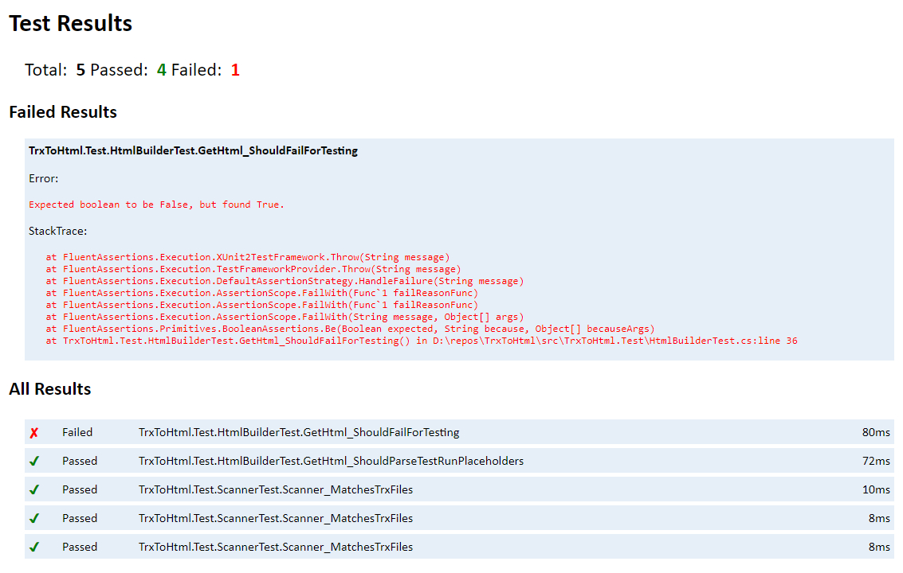

# TrxToHtml

With this tool you can convert trx text results into an readable html report.



## Installation
```shell
dotnet tool install -g TrxToHtml
```

## Usage
generate trx results (*.trx) with dotnet test and then just execute trx-to-html in the same/parent folder to generate report (TestResults.html).

```shell
dotnet test -l trx
trx-to-thml
```

## Options
to list all options use help

```shell
trx-to-thml --help
```

## Contribute

#### How to publish package
- set package version in TrxToHtml.csproj
- create git tag
- dotnet pack -c Release
- nuget push .\bin\Release\TrxToHtml.*.nupkg NUGET_API_KEY -src https://api.nuget.org/v3/index.json
- (optional) nuget setapikey NUGET_API_KEY -source https://api.nuget.org/v3/index.json
